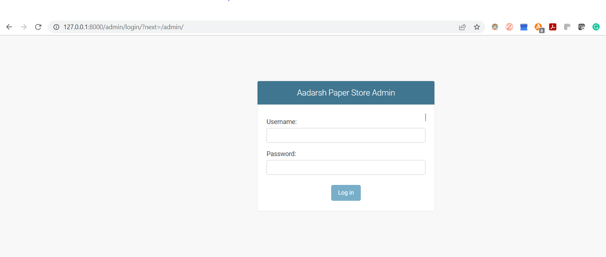
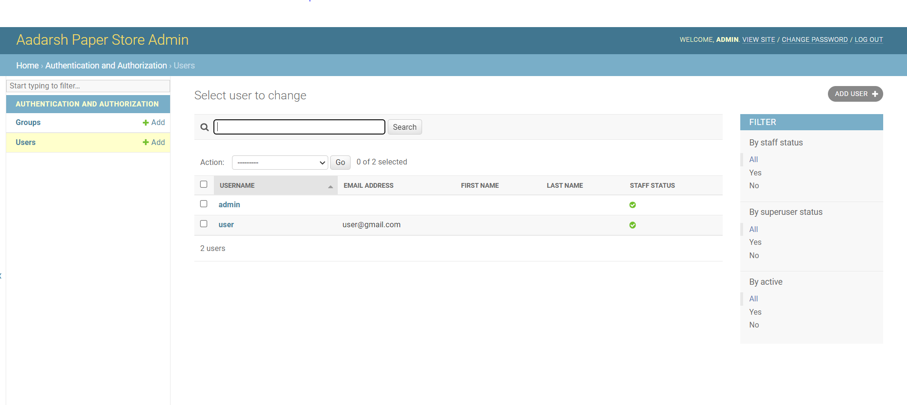
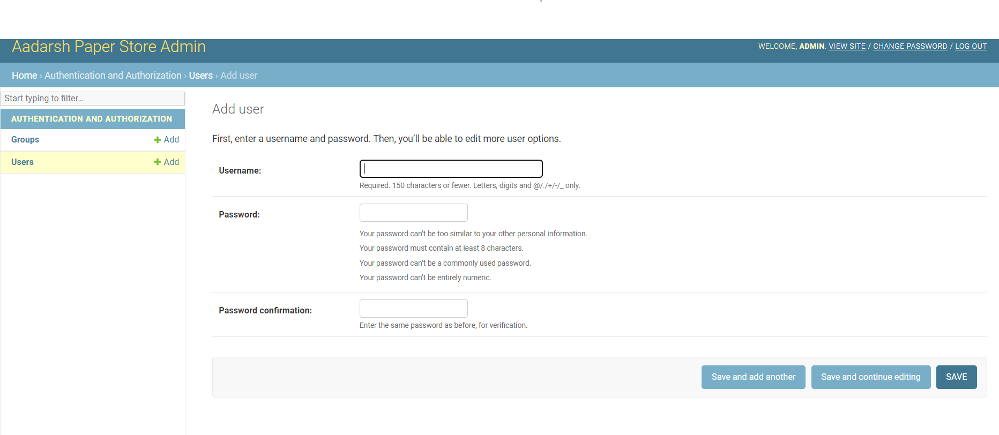
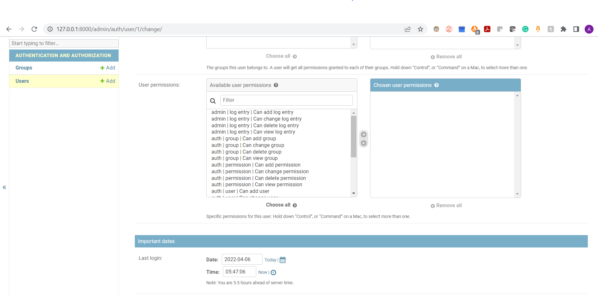

# Dunder Mifflin Paper Company


Folder structure
===================

```
+-- news_paper
|   +-- __pycache__
|   +-- __init__.py
|   +-- asgi.py
|   +-- model.py
|   +-- settings.py
|   +-- urls.py
|   +-- wsgi.py
|
+-- playground
|   +--  __pycache__
|   +-- migrations
|   +-- __init__.py
|   +-- admin.py
|   +-- apps.py
|   +-- models.py
|   +-- tests.py
|   +-- urls.py
|   +-- views.py
+-- static/
|   +-- css
|   +-- image
|   +-- js
|   +-- vendor
+-- template
|   +-- index.hrml
|   +-- test.html
+-- d.sqllite3
+-- manage.py
```


Implementation
========================
---Login Page--

<p align="center">
  
</p>

---Users List---

<p align="center">
  
</p>

---New User---

<p align="center">
  
</p>

--- Grant_user_permission---

<p align="center">
  
</p>


